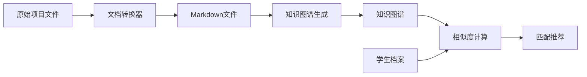

# ProjectMatching - 学生项目智能匹配系统

> 基于知识图谱的学生-项目智能匹配系统

[](https://www.python.org/downloads/)
[](LICENSE)

## 🎯 项目简介

ProjectMatching 是一个智能匹配系统，通过知识图谱技术将学生与合适的项目进行匹配。系统可以：
- 📄 处理和转换项目文档
- 🕸️ 构建项目、学生、课程的知识图谱
- 🤖 使用Ollama生成学生档案
- 🎯 计算学生-项目相似度并推荐最佳匹配

## ✨ 主要功能

| 功能模块 | 说明 |
|---------|------|
| **文档转换** | 支持DOCX、PDF、PPT等格式转换为Markdown |
| **知识图谱** | 构建项目、学生、课程的综合知识图谱 |
| **档案生成** | 基于Ollama LLM生成真实的学生档案 |
| **智能匹配** | 多维度相似度计算和推荐算法 |
| **可视化** | 生成知识图谱的可视化图像 |

## 📁 项目结构

```
ProjectMatching/
├── src/                    # 源代码
│   ├── converters/         # 文档转换器
│   ├── knowledge_graphs/   # 知识图谱生成器
│   ├── profile/           # 学生档案生成器
│   ├── matching/          # 匹配算法
│   ├── utils/             # 工具函数
│   └── cli/               # 命令行接口
├── data/                  # 数据文件（原始+处理后）
├── outputs/               # 生成的输出结果
├── docs/                  # 详细文档
└── scripts/               # 辅助脚本
```

## 🚀 快速开始

### 1. 安装依赖

```bash
# 创建虚拟环境
python3 -m venv .venv
source .venv/bin/activate

# 安装依赖
pip install -r requirements-all.txt
```

### 2. 转换文档

```bash
python src/converters/document_converter.py
```

### 3. 生成知识图谱

```bash
# 推荐使用平衡版生成器
python src/knowledge_graphs/balanced_kg_generator.py
```

### 4. 生成学生档案（需要Ollama）

```bash
# 启动Ollama
ollama serve

# 生成档案
python src/cli/main_cli.py generate --all
```

### 5. 计算匹配度

```bash
python src/matching/similarity_matrix.py
```

## 📊 数据统计

- **项目**: 20个IFN712项目提案
- **课程**: 2个QUT课程大纲（IN20, IN27）
- **学生档案**: 200个生成的学生档案
- **知识图谱**: 项目、学生、课程的个体和综合知识图谱

## 🔧 技术栈

| 技术 | 用途 |
|------|------|
| **Python 3.7+** | 主要编程语言 |
| **NetworkX** | 图处理和知识图谱构建 |
| **Pandas** | 数据处理和分析 |
| **Matplotlib** | 数据可视化 |
| **Ollama** | 本地LLM（学生档案生成） |
| **PyPDF2** | PDF文档处理 |

## 📖 文档

- 📘 [详细文档](docs/README.md) - 完整的项目文档
- 🚀 [快速开始](QUICKSTART.md) - 项目重组和快速开始
- 📋 [重组总结](REORGANIZATION_SUMMARY.md) - 项目结构重组说明
- 🇨🇳 [使用指南](docs/USAGE_CN.md) - 中文使用指南
- 📝 [项目总结](docs/PROJECT_SUMMARY_CN.md) - 中文项目总结

## 🛠️ 命令行工具

系统提供多个CLI工具：

```bash
# 主CLI - 学生档案生成
python src/cli/main_cli.py --help

# 知识图谱CLI
python src/cli/kg_cli.py --help

# 项目+Unit知识图谱
python src/cli/project_unit_cli.py --help

# 实验CLI
python src/cli/experiment_cli.py --help
```

## 📈 工作流程



## 🔄 项目状态

**当前版本**: 1.0.0

**最近更新**:
- ✅ 重组项目结构，模块化代码
- ✅ 添加完整的文档和使用指南
- ✅ 创建.gitignore和依赖管理
- ✅ 实现平衡版知识图谱生成器
- ✅ 支持项目+Unit综合知识图谱

## 🤝 贡献

欢迎贡献！请随时提交Issue或Pull Request。

## 📄 许可证

本项目采用 MIT 许可证 - 详见 [LICENSE](LICENSE) 文件

## 👥 作者

- Lynn - 初始开发

## 🙏 致谢

- QUT Faculty - 提供课程数据
- Ollama - 本地LLM支持
- NetworkX - 图处理库

---

## 💡 提示

### 首次使用？

1. 阅读 [QUICKSTART.md](QUICKSTART.md)
2. 查看 [docs/README.md](docs/README.md) 了解详细功能
3. 运行 `bash scripts/preview_reorganization.sh` 查看项目结构

### 需要重组项目？

```bash
# 先备份
cp -r . ../ProjectMatching_backup

# 预览重组效果
bash scripts/preview_reorganization.sh

# 执行重组
bash scripts/reorganize_project.sh
```

### 遇到问题？

- 🐛 查看已知问题: [Issues](https://github.com/yourusername/ProjectMatching/issues)
- 📧 联系作者
- 📖 阅读详细文档

---

**Happy Coding! 🎉**

